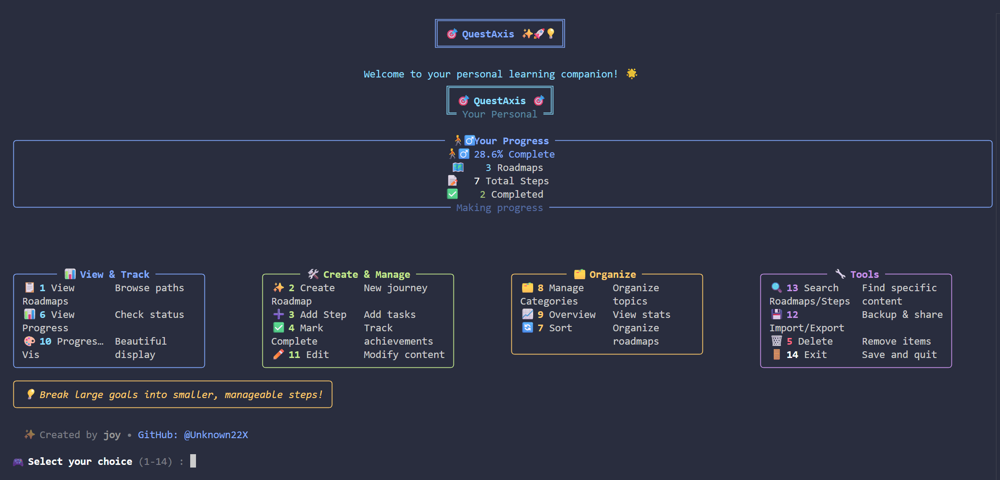

# QuestAxis 

<br />
<div align="center">
  <a href="https://github.com/Unknown22X/QuestAxis">
    
  </a>

  <h3 align="center">A Command-Line Learning Roadmap Application</h3>

  <p align="center"> 
    <a href="https://github.com/Unknown22X/QuestAxis"><strong>Explore the docs »</strong></a>
    <br />
    <br />
    <a href="[](https://youtu.be/5z7uMPXgwwU)">View Demo (CS50)</a>
    &middot;
    <a href="https://github.com/Unknown22X/QuestAxis/issues/new?labels=bug&template=bug-report.md">Report Bug</a>
    &middot;
    <a href="https://github.com/Unknown22X/QuestAxis/issues/new?labels=enhancement&template=feature-request.md">Request Feature</a>
  </p>
</div>

<details>
  <summary>Table of Contents</summary>
  <ol>
    <li>
      <a href="#overview">Overview</a>
      <ul>
        <li><a href="#demo">Demo</a></li>
      </ul>
    </li>
    <li>
      <a href="#about-the-project">About The Project</a>
      <ul>
        <li><a href="#key-features
">Key Features
</a></li>
      </ul>
    </li>
    <li>
      <a href="#getting-started">Getting Started</a>
      <ul>
        <li><a href="#prerequisites">Prerequisites</a></li>
        <li><a href="#installation">Installation</a></li>
      </ul>
    </li>
    <li><a href="#license">License</a></li>
    <li><a href="#acknowledgments">Acknowledgments</a></li>
    <li><a href="#contact">Contact</a></li>
  </ol>
</details>


[](https://www.python.org)
[](LICENSE)
[]()

##  Overview

Hello I'm Jory, a 15yo self-learner, and **QuestAxis** is my final project for CS50x .
**QuestAxis** is a CLI application tool for creating, managing, and visualising learning roadmaps ,allowing users to structure goals such as learning calculus through adding steps like “Learn Limits” or “Practice Derivatives” Developed using Python and rich library, it offers an intuitive interface with progress tracking, search functionality, and export options (Such as PDF and CSV). Inspired by my urge to organize my self-study

it is for anyone who want to learn 🌌! 


#### [Youtube Video Demo](https://youtu.be/5z7uMPXgwwU)

*****

## Demo


## About the Project

QuestAxis empowers users to organize their learning by creating structured roadmaps, tracking progress, and visualizing achievements .
It is designed for anyone who wants to learn efficiently


### Features

#### Roadmap Management

- Create unlimited number of learning roadmaps, so you can plan in detail.

- Roadmaps can be sorted into categories like Programming, Mathematics or Languages to help with organization.

- Let’s you create custom categories, so you can add a personal touch to learning management.

- Titles and descriptions of each roadmap can be fully edited, so you can update your learning goals and objectives as you progress.

#### Progress Tracking

- Break down goals into smaller steps.

- Mark steps as complete or incomplete.

- Display progress bars with percentages.

- Show real time statistics and analytics.

#### Visual Interface

- Use  `rich` library for a colorful terminal interface.

- Animated welcome screens and loading effects.

- Visualize progress with emojis and color coded indicators.

- Motivational messages based on progress.

#### Organization Tools

- Manage categories efficiently.

- Sort roadmaps by title, progress or category.

- Filter roadmaps by category.

- Show dashboard overview.

#### Data Management

- Import and export roadmaps in JSON, PDF, CSV or Markdown.

- Auto save data in `data.json`.

- Backups and sharing of learning paths.

- Safe deletion with confirmation prompts.

#### Analytics

- Track overall progress across roadmaps.

- Category specific progress breakdowns.

- Completion statistics and trends.

- Insights and recommendations for learning efficiency.

## Getting Started

### Prerequisites
- Python 3.10 or higher installed on your system.

### Installation

1. **Clone the repository :**
   ```bash
   git clone https://github.com/Unknown22X/QuestAxis
   cd QuestAxis
   ```


1. **Install required dependencies:**
   ```bash
   pip install requirements.txt
   ```

2. **Run the app:**
   ```bash
   python main.py
   ```

### First Steps

1. Launch QuestAxis to view the animated welcome screen.
2. Select "Create Roadmap" (option 2) from the main menu.
3. Add learning steps (option 3) to break down your goals.
4. Mark steps as complete (option 4) to track progress.
5. Visualize progress (option 10) .
   
## Detailed Usage Guide

### Creating Roadmaps
1. Select "Create Roadmap" from the main menu.
2. Choose or create a category (e.g Mathematics).
3. Enter a roadmap title (e.g., “Master Calculus”).
4. Add steps to structure your learning path.

### Managing Categories
Access the "Manage Categories" section to:
- View all categories with associated roadmap counts.
- Add new categories for organization.
- Delete unused categories with safety checks.

### Progress Visualization
The "Progress Visualization" feature provides:
- Overall learning statistics.
- Individual roadmap progress bars.
- Breakdown of completed versus pending steps.
- Motivational messages to encourage progress.

### Import/Export
- **Export**: Save roadmaps to JSON, PDF, Markdown , or CSV for sharing or backups.
- **Import**: Load roadmaps from JSON files.
- The data is stored in  `data.json` file.

## Interface Overview

### Main Menu Sections

| Section             | Description                           | 
|---------------------|---------------------------------------|
| 📊 View & Track     | Progress viewing and analytics        | 
| 🛠️ Create & Manage  | Roadmap and step creation/editing     | 
| 🗂️ Organize         | Category management and sorting       | 
| 🔧 Tools & Utilities| Import/export and data management     | 

### Progress Indicators
- 💤 **Not Started** (0%): Ready to begin.
- 🌱 **Beginning** (<25%): Initial progress.
- 🚶‍♂️ **Progressing** (<50%): Steady advancement.
- 🚀 **Good Pace** (<75%): Strong momentum.
- 🔥 **Almost There** (<100%): Nearing completion.
- 🎉 **Completed** (100%): Goal achieved.

## File Structure

### Detailed File Descriptions

- **main.py**: 
  This file contains the core application logic responsible for initializing the command line interface, showing the animated welcome sequence ('via ui_components.py'), and handling the main menu. It responds to user actions to switch between options like creating roadmaps and checking progress, and interacts with other modules to accomplish this task

- **category_manager.py**:  Provides the functions to manipulate categories (e.g. “Mathematics”, “Programming”) for creating, viewing, and deleting, as well as organized storage of roadmaps within data.json .

- **progress_tracker.py**:  Responsible for the completion visualization system, calculating completion rates, and creating progress bars with emojis for each range (e.g. 🚀 “Good Pace”) using the rich library.

- **roadmap_operations.py**: Contains the implementations for the primary functionalities of a roadmap, such as creating, editing, and searching roadmaps/steps. For the search function, the system performs string matching and can quickly retrieve steps including the term like “calc”.

- **import_export.py**: Responsible for the import/export of data in JSON, PDF, CSV, and Markdown formats and ensures data integrity during the file operations.

- **ui_components.py**:  Uses rich to provide a colorful and user-friendly terminal interface and defines reusable components for the UI, like panels, tables, and different animated sequences.

- **data.json**: Contains root roadmap data (categories, titles, steps, and priorities) in a structured format, as well as in JSON which is periodically updated by the application.

- **requirements.txt**: Lists dependencies (`rich`, `pandas`, `fpdf`) for easy setup. 
```
QuestAxis/
├── main.py                 # Main application file
├── data.json               # Roadmap data (auto-generated)
├── category_manager.py     # Category management functions
├── progress_tracker.py     # Progress visualization logic
├── roadmap_operations.py   # Roadmap creation and search
├── import_export.py        # Import/export functionality
├── ui_components.py        # UI elements and animations
├── README.md               # Documentation file
├── requirements.txt        # Dependencies list
├── images/                 # overview and demo assets
│   ├── img.png
│   └── demo.gif
```

## Technical Details

### Dependencies
Check `requirements.txt`
- **Rich**: Enables colorful terminal interfaces.
- **Pandas**: Supports CSV export functionality.
- **FPDF**: Facilitates PDF export generation.

### Data Storage
Data is stored in `data.json` with the following structure:

```json
{
  "categories": ["Programming", "Mathematics", "Languages"],
  "roadmaps": [
    {
      "title": "Master Calculus",
      "category": "Mathematics",
      "steps": [
        {
          "title": "Learn Limits",
          "done": true, 
          "priority": "high"
        }
      ]
    }
  ]
}
```


## Contributing

Contributions are welcome , Here's how you can help:

1. **Fork the repository**
2. **Create a feature branch**: `git checkout -b feature/amazing-feature`
3. **Commit changes**: `git commit -m 'Add amazing feature'`
4. **Push to the branch**: `git push origin feature/amazing-feature`
5. **Open a Pull Request**


## Troubleshooting

### Common Issues

- **Interface display issues**: Ensure your terminal supports Unicode and colors (e.g., Windows Terminal, iTerm2, GNOME Terminal).
- **Data not saving**: Verify write permissions for the project directory.
- **Import/Export failures**: Confirm valid JSON file formats and correct file paths.
- **Data overwritten on update** ? Back up data.json before git pull. It’s excluded in .gitignore to protect your roadmaps.
## License

This project is licensed under the MIT License. See the [LICENSE](LICENSE) file for details.
## Acknowledgments

- **CS50 Team** - For the outstanding Course
- **Rich Library** - For enabling vibrant terminal interfaces.
- **Python Community** 

## Contact
- **GitHub**: [Unknown22X](https://github.com/Unknown22X)
- **Bug Reports**: [GitHub Issues](https://github.com/Unknown22X/QuestAxis/issues)
- **Feature Requests**: [GitHub Discussions](https://github.com/Unknown22X/QuestAxis/discussions)

---

<div align="center">
  Thank You, CS50 team ! <br />
  Created with dedication for learners worldwide. <br />
  ⭐ Star this repository if it supports your 
  learning or you just like it!
</div>